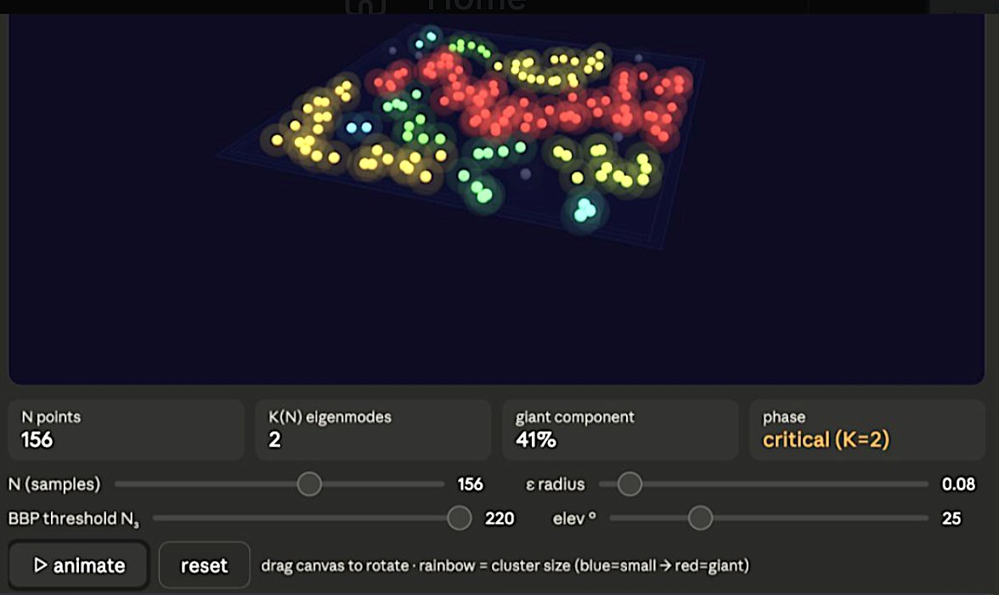
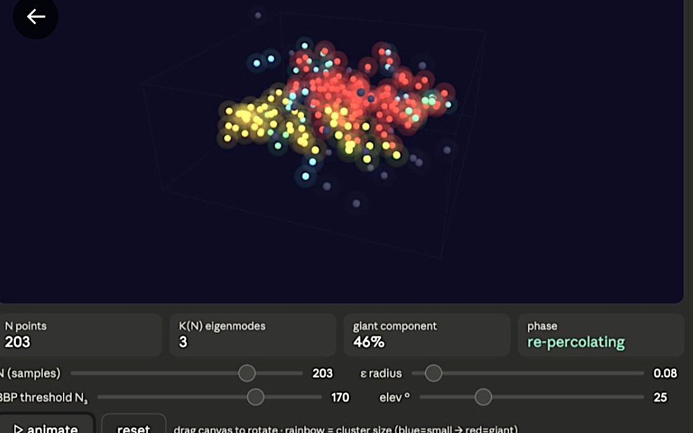

# K(N) = 2 → 3 Eigenspace Percolation Transition

> **How much data is enough?** Training data as translucent epsilon-balls in embedding space, coloured by cluster size (blue→red). Drag N to watch percolation into a red giant component, then at the BBP transition a new eigenmode K(N) opens and the cover shatters. Based on our papers, [1] and [2] below.

**Based on:**

> [1] Thompson, P.M. (2026). *How Much Data is Enough? The Zeta Law of Discoverability in Biomedical Data, featuring the enigmatic Riemann zeta function.* [arXiv:2604.17581](https://arxiv.org/abs/2604.17581)
>
> [2] Thompson, P.M. (2025). *How Much Data Is Enough? Uniform Convergence Bounds for Generative & Vision-Language Models under Low-Dimensional Structure.* [arXiv:2512.23109](https://arxiv.org/abs/2512.23109)

🔗 **Live demo:** https://[username].github.io/percolation-k2k3

---

## Screenshots

### K=2 phase · critical regime (N=156, giant=41%)

Points lie on the blue 2D eigenplane (e₁–e₃). Clusters of all sizes coexist —
blue/teal isolated points, green and yellow growing clusters, and a dominant red
giant component spanning much of the plane. The phase reads **critical (K=2)**.



---

### K=3 phase · re-percolating (N=203, giant=46%)

After the BBP threshold at N₃=170, the third eigenmode opens and points lift off
the plane into 3D. The previously spanning red giant instantly becomes a thin slice
of the larger 3D volume — coverage fraction drops and the distribution fragments.
New isolated blue/teal points appear at the edges while the re-percolation of the
3D cloud is underway. Phase reads **re-percolating**.



---

## What the app shows

Training data points arrive one by one into a whitened embedding space whose
active dimension K(N) grows with sample size N, governed by the
Baik–Ben Arous–Péché (BBP) phase transition from random matrix theory
(see [1] for the definition of K(N) and the spectral framework, and [2] for
the epsilon-ball covering and data sufficiency bounds).

Each point is rendered as a translucent ε-ball — the region it "covers" in
the whitened space. Two points are connected when their ε-balls overlap,
i.e. when their Mahalanobis distance is less than 2ε. Connected components
are found by union-find and coloured on a rainbow scale by cluster size:

🔵 **Blue** → isolated · 🟢 **Green** → growing cluster · 🟡 **Yellow** → large cluster · 🔴 **Red** → giant spanning component

### The K=2 phase

In the K=2 phase (N below the BBP threshold slider), all points land on the
blue hyperplane — the 2D eigenspace spanned by the two resolved eigenmodes.
The ε-balls are translucent spheres whose colour encodes cluster size — blue
for isolated, shifting through green and yellow toward red as the giant
component grows. You can watch the coalescence happen: small clusters merge,
the colour warms, and eventually one dominant red blob spans the plane.
That is percolation in the 2D eigenspace.

### At the BBP threshold

At the BBP threshold (drag the N₃ slider to control when the third eigenmode
opens), the points suddenly lift off the plane into a 3D cloud. The previously
red giant component instantly becomes a thin slice of a larger 3D space —
coverage fraction drops, the colour cools back toward blue/green, and you are
back in the fragmented regime. This is the discontinuity in γ(N) described in
the theory.

### Re-percolation in 3D

The re-percolation in 3D requires substantially more points than the original
2D percolation did — because the volume to fill scales as ε^d, and d just
jumped from 2 to 3. You can drag the elevation slider or click and drag the
canvas to see the 3D geometry from any angle.

### The core theory

The percolation threshold satisfies:

```
N_c ≈ ρ_c(d) · Vol(M_w) / V_d(ε)
```

where ρ_c(d) is the critical density of d-dimensional Boolean percolation,
M_w is the whitened manifold, and V_d(ε) is the d-ball volume. This threshold
is **invariant to the eigenvalue spectrum** of the raw data covariance — it
depends only on the Mahalanobis geometry and the regularisation parameter.

The BBP transition at N_BBP(k) = D / (λ_k − 1)² governs when the k-th
eigenmode becomes statistically resolvable (K(N) increases by 1). The
percolation threshold then determines when that subspace is geometrically
covered. These are two sequential phase transitions per eigenmode: first
visibility (BBP), then connectivity (percolation).

---

## Controls

| Control | Description |
|---------|-------------|
| **N slider** | Number of training samples |
| **ε slider** | Ball radius in whitened space. Larger ε → lower N_c |
| **BBP threshold N₃** | Sample size at which the third eigenmode opens (K: 2→3) |
| **elevation °** | Camera elevation angle |
| **▶ animate** | Sweep N from 1 to 260, slowing near the BBP transition |
| **drag canvas** | Manual orbit |
| **scroll** | Zoom |

**Suggested experiments:**

- Set ε to minimum and BBP threshold to minimum (40) — the third eigenmode
  opens while the 2D cover is still fragmented. This is the dangerous regime
  where N_BBP(3) < N_perc(2D).
- Set ε large and BBP threshold large (220) — the plane percolates fully
  (solid red) well before the third mode opens.
- Drag elevation to ~70° to see the hyperplane edge-on during the K=2 phase,
  then watch it become a 3D slab after the BBP transition.

---

## Files

```
index.html                      — self-contained interactive figure (no build step)
README.md                       — this file
screenshot_k2_critical.png      — K=2 phase, critical regime (N=156)
screenshot_k3_repercolating.png — K=3 phase, re-percolating (N=203)
LICENSE                         — MIT
```

## Running locally

```bash
open index.html
# or serve with:
python3 -m http.server 8080
# then open http://localhost:8080
```

## Citing

```bibtex
@article{thompson2026zeta,
  title   = {How Much Data is Enough? {T}he Zeta Law of Discoverability
             in Biomedical Data, featuring the enigmatic {R}iemann zeta function},
  author  = {Thompson, Paul M.},
  journal = {arXiv preprint arXiv:2604.17581},
  year    = {2026}
}

@article{thompson2025convergence,
  title   = {How Much Data Is Enough? {U}niform Convergence Bounds for
             Generative \& Vision-Language Models under Low-Dimensional Structure},
  author  = {Thompson, Paul M.},
  journal = {arXiv preprint arXiv:2512.23109},
  year    = {2025}
}
```

## Dependencies

- [Three.js r128](https://threejs.org/) — loaded from cdnjs CDN
- No other dependencies. Pure HTML/CSS/JS, no build step.

## License

MIT — see LICENSE.
